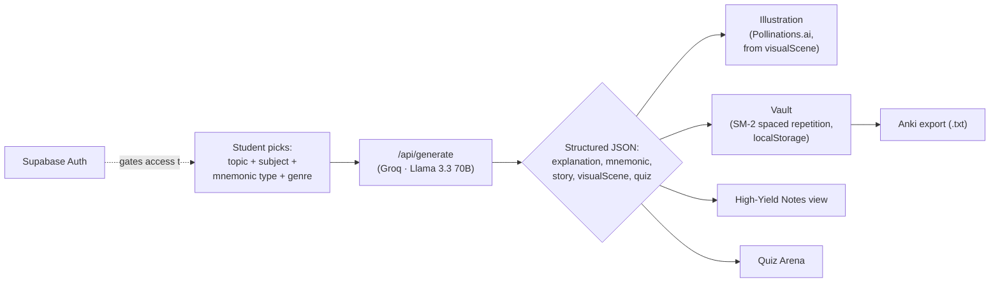

<div align="center">

# 🧠 MnemonicFlow Pro

**An AI memory architect for MBBS students.**
Give it a topic. Get back a story, an acronym, an illustration, an exam note sheet, and a quiz question — then never forget it, because it's already sitting in a spaced-repetition vault.

`Next.js 14` · `TypeScript` · `Groq (Llama 3.3 70B)` · `Supabase` · `Tailwind CSS`

</div>

---

## Table of contents

- [a. The problem, and who it's for](#a-the-problem-and-who-its-for)
- [b. Live URL](#b-live-url)
- [c. How it fits together](#c-how-it-fits-together)
- [d. Walkthrough — what you can actually do in the app](#d-walkthrough--what-you-can-actually-do-in-the-app)
- [e. The AI feature — how it works, and the exact prompt behind it](#e-the-ai-feature--how-it-works-and-the-exact-prompt-behind-it)
- [f. How this compares to what's already out there](#f-how-this-compares-to-whats-already-out-there)
- [g. Tools, services, and models used](#g-tools-services-and-models-used)
- [h. Screenshots](#h-screenshots)
- [i. Running it locally / deploying it](#i-running-it-locally--deploying-it)
- [Project structure](#project-structure)
- [Known limitations](#known-limitations)

---

## a. The problem, and who it's for

MBBS students memorize an enormous volume of arbitrary-feeling facts — enzyme cascades, receptor subtypes, cranial nerve branches, drug mechanisms — that a textbook paragraph alone doesn't make stick. The usual workaround is inventing your own acronym or story by hand, which is slow, and the output quality depends entirely on how creative you feel at 1am before an exam.

None of the existing tools close the full loop:

- **A generic AI chat** can write a mnemonic if you ask nicely, but it's a one-off: no memory system, no matching image, no review schedule, and quality swings wildly with how you phrase the ask.
- **Anki** is an excellent spaced-repetition engine but gives zero help *generating* the mnemonic — you still have to invent the hook before you can even make the card.
- **Osmosis**-style platforms hand you polished pre-made content for common topics, but nothing for the specific, niche topic your professor emphasized this week.

**MnemonicFlow Pro** is built for MBBS students — starting with myself, across the 19 standard subjects from first year through final year — who want all of it in one flow: generate the memorable hook → get a matching illustration → save it as a real spaced-repetition flashcard → get auto-written exam notes on the same topic → quiz yourself on it later. One tool instead of four.

## b. Live URL

🔗 **`[TODO — paste your live Vercel URL here]`**

Deploying takes about 3 minutes once you have a Groq key and a Supabase project — exact commands are in [section i](#i-running-it-locally--deploying-it).

## c. How it fits together



One generation call produces every downstream artifact — the story, the image prompt, the flashcard, the notes, and the quiz question are all the *same* AI output, rendered five different ways, not five separate requests.

## d. Walkthrough — what you can actually do in the app

**1. Sign up / log in** — Email + password auth via Supabase. New accounts get a confirmation email; the profile page shows account details and a sign-out control.

**2. Pick a subject and topic** — The left sidebar lists 19 MBBS subjects (Anatomy, Physiology, Biochemistry, Pharmacology, Pathology, Microbiology, Forensic Medicine, Community Medicine, Medicine, Surgery, OBGYN, Pediatrics, Psychiatry, Dermatology, Orthopedics, ENT, Ophthalmology, Radiology, Anesthesia), each tagged to its MBBS year with example topics to get started, or you can type your own.

**3. Configure how you want it explained** — Before generating, choose:
- **Mnemonic structure** — Acronym (strict first-letter), Storyline (a character physically acts out the mechanism), Spatial map (facts placed at fixed positions in a scene, like a labeled diagram), or Hybrid (all three at once)
- **Narrative genre** — Clinical, Dramatic, Comedy, Fantasy, Horror, Sci-Fi, Historical, Detective noir, Movie-trailer, Anime, or **Meme Recall™** (the app randomly assigns a real meme format — Drake, Gigachad, Galaxy Brain, Distracted Boyfriend, and 8 others — and the AI recreates that exact panel structure using the medical facts, with original non-celebrity characters)
- **Art style** for the generated illustration — hand-drawn "Sketchy" medical-textbook style, or flat-vector "Osmosis" whiteboard style

**4. Generate** — One click sends all of that to the AI (see [section e](#e-the-ai-feature--how-it-works-and-the-exact-prompt-behind-it)). Within seconds you get: a short high-yield explanation, the mnemonic itself, a key mapping each letter/word/zone to its fact, the full 4-line story in your chosen genre, a matching illustration, an Anki-ready front/back card, and a one-line quiz question with its answer.

**5. Save to the Vault** — Any generation can be saved as a flashcard (with its image). The vault runs the **SM-2 spaced-repetition algorithm** — the same scheduling logic Anki uses. After each review you rate your recall 0–5, and that rating sets the card's next interval and ease factor. Due cards get a badge; filter by subject, "due today," or favorites.

**6. Export to Anki** — Export your whole vault as a tab-separated `.txt` file that imports straight into Anki desktop as Basic notes.

**7. High-Yield Notes** — For any topic you've generated, switch to a structured exam-notes view: definition, pathophysiology, clinical features, investigations, management, drug names, a comparison table, exam pearls, common traps, and FAQs — built from the same generation but formatted for last-minute revision, not storytelling.

**8. Quiz Arena** — Turns your saved topics into a timed practice quiz (MCQ / clinical vignette / rapid-fire / fill-in-the-blank), tracking score and an XP counter, with the explanation shown right after each answer.

## e. The AI feature — how it works, and the exact prompt behind it

The core AI feature is the **generation engine**, in `app/api/generate/route.ts`, called every time you click "Generate." It's a server-side API route — the API key never reaches the browser — that calls **Groq's `llama-3.3-70b-versatile`** with a fixed system prompt plus a user prompt assembled on the fly from your choices, and forces one exact JSON schema back so the UI can render it reliably.

**System prompt — sent unchanged on every request:**
```
You are a world-class medical memory architect for MBBS students. Generic output, or output that ignores the requested story style, is a failure condition. Rules you never break:
- Explanation: exactly 3-4 sentences, 70% precise medical jargon 30% vivid real-world analogy, high-yield only, and always written in a plain educational voice regardless of story style
- Mnemonic: follow the requested mnemonic type exactly (acronym / storyline / spatial / hybrid) as instructed in the user prompt
- Story: EXACTLY 4 lines (or spatial-map equivalent), written fully inside the requested story style's world and voice — a Fantasy story and a Detective story about the same topic must read like two different genres, not the same sentence with swapped nouns. Literal physical/visual representation of the mechanism step by step, NEVER explain individual letters
- Story style discipline: unless the style is Clinical, do not default to a hospital, doctor, or patient setting, and never open the story with "A doctor...", "A patient...", or "A hospital..."
- Visual scene: concrete, literal scene description — no abstraction — matching the story exactly and set in the same non-generic world as the story, since it will be rendered as a hand-drawn medical illustration, not a cartoon
- Quiz: one short punchy self-test question + one-line answer testing the highest-yield fact
Output ONLY valid JSON, nothing else.
```

**Why it's written this way:** early testing without these constraints produced generic, forgettable output — the model defaulted to "a doctor explains X to a patient" regardless of the requested genre, and padded explanations with filler. Each rule closes a specific failure mode. The "BANNED OPENERS" rule and the per-genre "world" hints (e.g. Fantasy must build a small magic system where the mechanism *is* a literal rule of that world; Detective noir is explicitly told not to default to a morgue/pathologist scene, which reads too close to Clinical) exist so ten different genre choices actually read like ten different pieces of writing about the same fact — not the same paragraph with the nouns swapped.

**The user prompt is assembled per request** from the topic, subject, mnemonic type, and genre — each choice injects its own detailed rule block (full text for all 4 mnemonic types and all 11 genres lives in `app/api/generate/route.ts`). For **Meme Recall™** specifically, the server picks one of 12 real meme templates at random (Gigachad, Drake, Distracted Boyfriend, Galaxy Brain, UNO Reverse, Woman Yelling at Cat, Surprised Pikachu, This Is Fine, NPC, Bro Is Cooked, "Nah I'd Win," Standing Here I Realize) and instructs the model to recreate that template's exact panel/beat structure using original, non-celebrity characters.

**Required output shape:**
```json
{
  "explanation": "3-4 sentences, high-yield only",
  "mnemonic": "the acronym / hook sentence, per the chosen type",
  "mnemonicKey": "word/letter/zone = medical fact, one line per item",
  "story": "the 4-line story, written fully in the chosen genre",
  "visualScene": "concrete literal scene description matching the story",
  "ankiFront": "high-yield exam question",
  "ankiBack": "answer + mechanism + mnemonic as the takeaway line",
  "quizQuestion": "one short self-test question",
  "quizAnswer": "one-line answer",
  "tags": ["subject", "MBBS", "genre"]
}
```

**Closing the loop from text to image:** the `visualScene` field the model writes is wrapped server-side with a hardcoded art-style block (Sketchy or Osmosis, each with detailed rendering instructions and a negative prompt to keep unwanted styles out) and sent to **Pollinations.ai's** free image endpoint. The exact scene the AI wrote for your story is the scene that gets illustrated — nothing is generated independently of the mnemonic.

## f. How this compares to what's already out there

| | Generic AI chat | Anki | Osmosis-style content | **MnemonicFlow Pro** |
|---|---|---|---|---|
| Generates a genre-specific mnemonic on demand | Inconsistent, prompt-dependent | ❌ | ❌ (pre-made only) | ✅ |
| Illustration matching the exact mnemonic | ❌ | ❌ | Pre-made, generic | ✅ auto-generated per topic |
| Spaced repetition (SM-2) | ❌ | ✅ | ❌ | ✅ |
| Auto exam notes + quiz from the same topic | ❌ | ❌ | Separate content | ✅ one generation, three views |
| Works for any niche/unusual topic | Depends on prompting skill | N/A | Only common topics | ✅ any topic you type |

## g. Tools, services, and models used

| Purpose | Tool / Service |
|---|---|
| Framework | Next.js 14 (App Router), TypeScript, React 18 |
| Styling | Tailwind CSS — custom neon color system, glassmorphism |
| AI text generation | **Groq API** — `llama-3.3-70b-versatile` |
| AI image generation | **Pollinations.ai** — free, key-less image endpoint, driven by the AI's own scene description |
| Auth + accounts | **Supabase** — email/password auth, `profiles` table |
| Flashcard persistence | Browser `localStorage`, running the SM-2 algorithm (swap-point documented in `app/lib/vault.ts` for a future Supabase-backed vault) |
| Icons | lucide-react |
| Recommended hosting | Vercel |

## h. Screenshots

> Add 3+ screenshots to `public/screenshots/` (folder already created in this repo) and embed them here:
> ```md
> 
> 
> 
> ```
> GitHub renders images straight from the repo — no external hosting needed.

## i. Running it locally / deploying it

### Prerequisites
- Node.js 18+
- A free [Groq API key](https://console.groq.com/keys)
- A free [Supabase](https://supabase.com) project — you'll need its project URL, anon key, and a `profiles` table matching what `app/profile/page.tsx` and `app/login/page.tsx` expect

### 1. Clone and install
```bash
git clone <your-repo-url>
cd mnemonicflow-pro
npm install
```

### 2. Configure environment variables
```bash
cp .env.local.template .env.local
```
Fill in `.env.local`:
```env
GROQ_API_KEY=your_groq_key_here
NEXT_PUBLIC_SUPABASE_URL=https://your-project.supabase.co
NEXT_PUBLIC_SUPABASE_ANON_KEY=your_supabase_anon_key_here
```
> ⚠️ `.env.local` is already in `.gitignore` — never commit it. If keys were ever exposed in a shared file, rotate them in the Groq and Supabase dashboards before submitting.

### 3. Run locally
```bash
npm run dev
```
Open [http://localhost:3000](http://localhost:3000).

### 4. Deploy to Vercel
```bash
npm install -g vercel
vercel
```
In the Vercel dashboard → your project → **Settings → Environment Variables**, add `GROQ_API_KEY`, `NEXT_PUBLIC_SUPABASE_URL`, and `NEXT_PUBLIC_SUPABASE_ANON_KEY`, then run `vercel --prod`. Paste the resulting URL into [section b](#b-live-url).

### 5. Push to GitHub
```bash
git init
git add .
git commit -m "MnemonicFlow Pro"
git branch -M main
git remote add origin https://github.com/<your-username>/<your-repo>.git
git push -u origin main
```
Open the repo URL in an incognito window before submitting, to confirm it's public and doesn't prompt for login.

---

## Project structure

```
mnemonicflow-pro/
├── app/
│   ├── api/
│   │   ├── generate/route.ts     ← Core AI generation route (Groq)
│   │   └── image/route.ts        ← Earlier single-style generation route
│   ├── auth/callback/route.ts    ← Supabase auth callback
│   ├── components/
│   │   ├── Sidebar.tsx           ← Subject navigation
│   │   ├── Workspace.tsx         ← Generation UI + image rendering
│   │   ├── VaultPanel.tsx        ← Flashcard vault + Anki export
│   │   ├── HighYieldNotes.tsx    ← Structured exam notes view
│   │   ├── QuizArena.tsx         ← Quiz/MCQ practice mode
│   │   ├── WelcomeDashboard.tsx  ← Landing/overview screen
│   │   ├── UserMenu.tsx / AuthGuard.tsx
│   │   └── PremiumFlashcard.tsx
│   ├── lib/
│   │   ├── subjects.ts           ← 19 MBBS subjects + example topics
│   │   ├── vault.ts              ← SM-2 spaced repetition + localStorage persistence
│   │   ├── supabase.ts           ← Supabase client
│   │   └── utils.ts
│   ├── login/page.tsx
│   ├── profile/page.tsx
│   ├── types/index.ts
│   ├── layout.tsx
│   └── page.tsx
├── public/
│   └── screenshots/              ← put README screenshots here
├── tailwind.config.js
├── .env.local.template
└── .gitignore
```

## Known limitations

- The flashcard vault currently lives in browser `localStorage`, not Supabase — cards don't sync across devices yet (swap-point already marked in `vault.ts` for when that's added).
- Quiz questions are generated client-side from the saved mnemonic data rather than freshly re-queried from the AI, so quiz variety depends on how many topics you've saved.
- Image generation depends on Pollinations.ai's uptime; if it's briefly unavailable, the illustration step will retry rather than falling back to a different provider.

## Roadmap

- [ ] Move the flashcard vault from `localStorage` to Supabase for multi-device sync
- [ ] Progress analytics dashboard
- [ ] Collaborative study rooms
